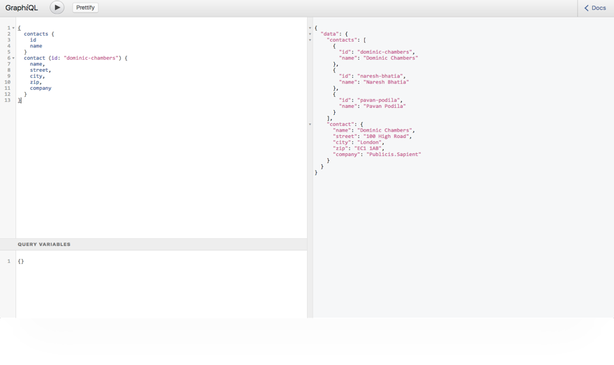

GraphQL Contacts Server
=======================



Getting started
---------------

Ensure you have [MongoDB](https://www.mongodb.com/) installed and running on localhost first, then:

```bash
$ npm install <--- substitute with yarn if you prefer it
$ npm run initdb
$ npm start
```

Now point your browser to [http://localhost:8080/graphiql](http://localhost:8080/graphiql). Once you've confirmed it's working install the [graphql-contacts](https://github.com/sapientglobalmarkets/graphql-contacts) front-end app.

Configuring Server-Side Validation
----------------------------------

You can optionally use the following config to configure server-side validation at the database level:

```
{
  "$and": [
    {
      "id": {
        "$type": 2
      }
    },
    {
      "name": {
        "$type": 2
      }
    },
    {
      "$or": [
        {
          "company": {
            "$type": 2
          }
        },
        {
          "company": {
            "$exists": false
          }
        },
        {
          "company": null
        }
      ]
    },
    {
      "$or": [
        {
          "email": {
            "$type": 2
          }
        },
        {
          "email": {
            "$exists": false
          }
        },
        {
          "email": null
        }
      ]
    },
    {
      "$or": [
        {
          "phone": {
            "$type": 2
          }
        },
        {
          "phone": {
            "$exists": false
          }
        },
        {
          "phone": null
        }
      ]
    },
    {
      "$or": [
        {
          "street": {
            "$type": 2
          }
        },
        {
          "street": {
            "$exists": false
          }
        },
        {
          "street": null
        }
      ]
    },
    {
      "city": {
        "$type": 2
      }
    },
    {
      "$or": [
        {
          "state": {
            "$type": 2
          }
        },
        {
          "state": {
            "$exists": false
          }
        },
        {
          "state": null
        }
      ]
    },
    {
      "$or": [
        {
          "zip": {
            "$type": 2
          }
        },
        {
          "zip": {
            "$exists": false
          }
        },
        {
          "zip": null
        }
      ]
    },
    {
      "$or": [
        {
          "dob": {
            "$type": 9
          }
        },
        {
          "dob": {
            "$exists": false
          }
        },
        {
          "dob": null
        }
      ]
    },
    {
      "$or": [
        {
          "notes": {
            "$type": 2
          }
        },
        {
          "notes": {
            "$exists": false
          }
        },
        {
          "notes": null
        }
      ]
    }
  ]
}
```
